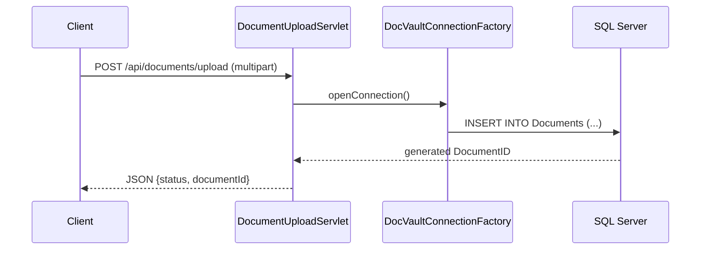

# API and Service Communication Contracts

## Exposed HTTP Contracts

| Endpoint | Method | Request | Response |
|---|---|---|---|
| `/health` | GET | none | HTML service status page |
| `/api/documents/upload` | POST (multipart) | `customerId`, `documentType`, `file` | JSON upload status with `documentId` |
| `/api/documents/customer/{customerId}` | GET | path `customerId` | JSON list of customer documents |
| `/api/documents/{id}` | GET | path `id` | Binary file stream with content headers |

## Sequence Diagram

