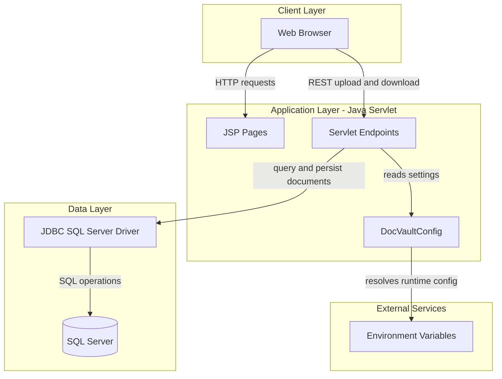
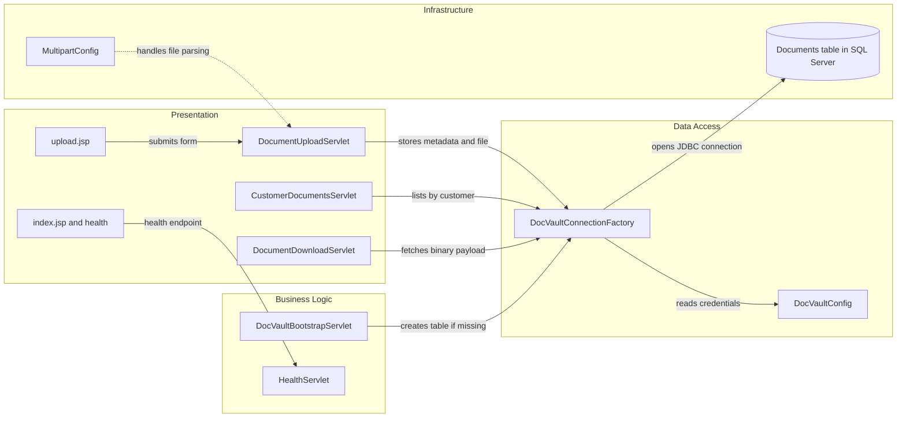

# Architecture Diagram

This document summarizes the high-level architecture and component interactions for ZavaDocVault. It captures the current Java servlet application structure and key runtime dependencies.

## Application Architecture

### Technology Stack Summary

| Layer | Technology | Version | Purpose |
|---|---|---|---|
| Presentation | JSP + Servlet endpoints | Servlet 3.1 | UI pages and HTTP API handling |
| Application | Java 8 | 1.8 | Request processing and validation |
| Data Access | JDBC + SQLServer driver | mssql-jdbc 12.6.3.jre8 | Database connectivity and queries |
| Runtime | Gradle + Tomcat | Gradle build, Tomcat 9 image | Packaging and deployment |

### Data Storage & External Services

The application stores documents in a SQL Server `Documents` table using JDBC prepared statements. Runtime configuration values are sourced from environment variables (with properties fallback), and no message broker or external API integration is present.

### Key Architectural Decisions

- Uses plain Servlet and JSP architecture with explicit servlet mappings in `web.xml`.
- Uses direct JDBC prepared statements instead of ORM abstractions for persistence.
- Centralizes database configuration lookup in `DocVaultConfig` with env-variable precedence.

## Component Relationships

### Component Inventory

| Component | Layer | Type | Responsibility |
|---|---|---|---|
| DocumentUploadServlet | Presentation | Servlet | Validates request and inserts uploaded document |
| CustomerDocumentsServlet | Presentation | Servlet | Lists document metadata by customer |
| DocumentDownloadServlet | Presentation | Servlet | Streams stored document content by id |
| HealthServlet | Business Logic | Servlet | Returns lightweight service health response |
| DocVaultBootstrapServlet | Business Logic | Startup servlet | Ensures table exists at startup |
| DocVaultConnectionFactory | Data Access | Factory | Opens SQL Server JDBC connections |
| DocVaultConfig | Data Access | Configuration utility | Resolves DB settings from env/properties |
