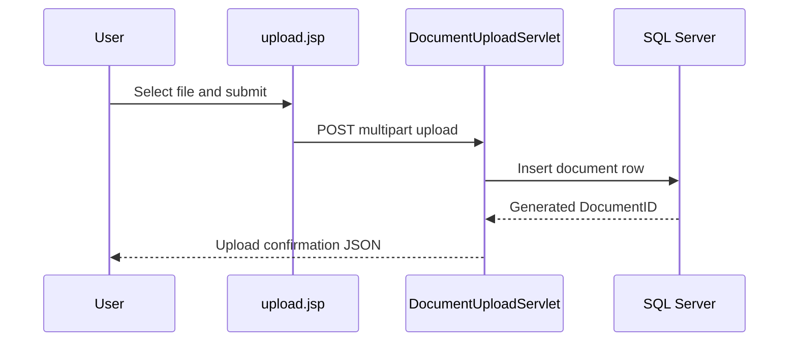

# Business Workflows

## Core Workflow: Document Upload

## Core Workflow: Document Retrieval

1. Client requests `/api/documents/customer/{customerId}` to list available documents.
2. Client selects a document id and requests `/api/documents/{id}`.
3. Service streams file bytes from SQL Server to the client.
