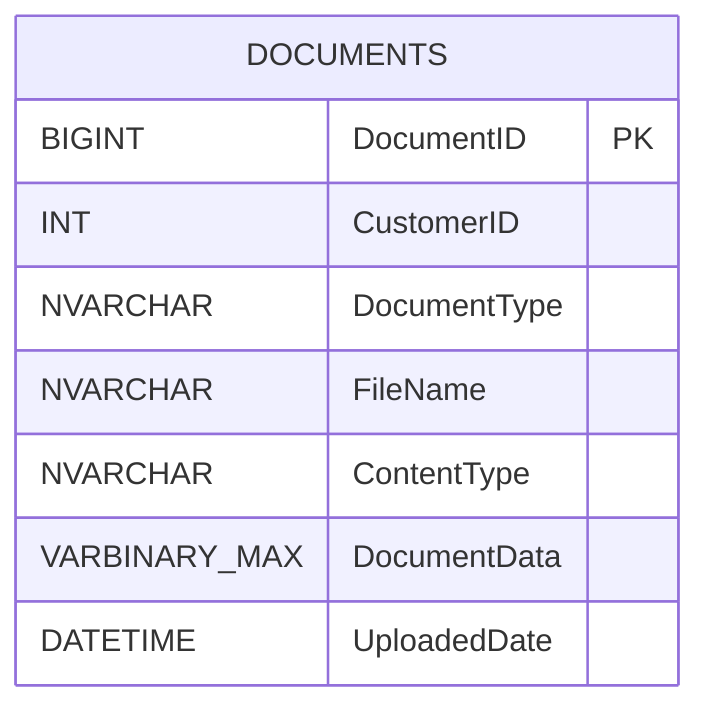

# Data Architecture

## Persistence Overview

The application uses SQL Server as a single system of record for document metadata and binary content.

## Data Model

## Access Pattern

- `DocumentUploadServlet` inserts rows and binary payloads.
- `CustomerDocumentsServlet` reads metadata by `CustomerID`.
- `DocumentDownloadServlet` reads binary payload by `DocumentID`.
