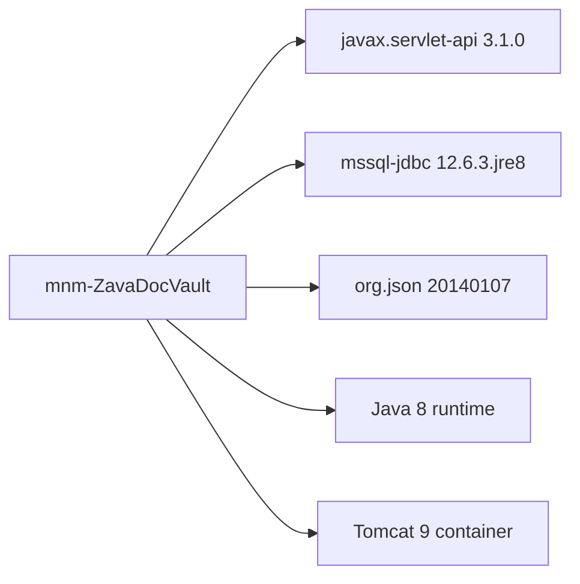

# Dependency Map

```mermaid
flowchart LR
    App["mnm-ZavaDocVault"] --> ServletApi["javax.servlet-api 3.1.0"]
    App --> SqlJdbc["mssql-jdbc 12.6.3.jre8"]
    App --> JsonLib["org.json 20140107"]
    App --> Java8["Java 8 runtime"]
    App --> Tomcat["Tomcat 9 container"]
```

## Notes

- Build system: Gradle (`java`, `war` plugins).
- Packaging target: WAR archive deployed as ROOT on Tomcat.
