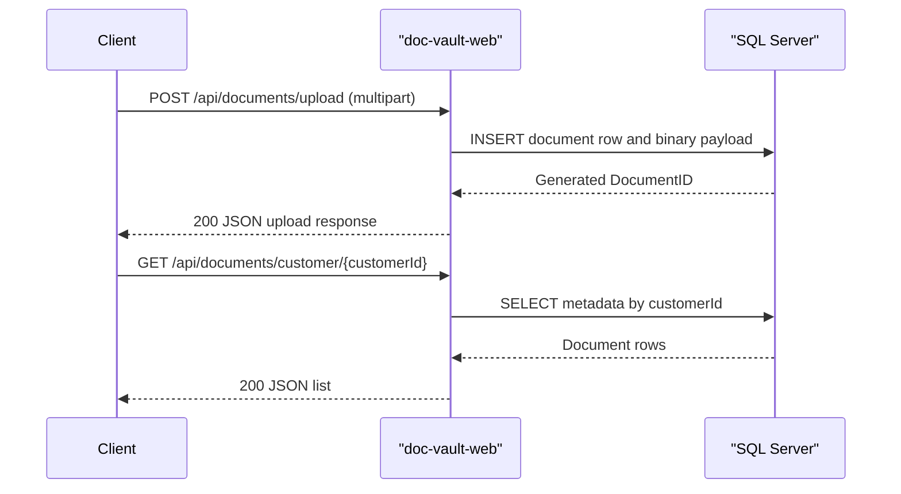

# API & Service Communication Contracts

This application exposes a small servlet-based API surface for document upload, listing, and download with synchronous request/response communication only.

## Service Catalog

| Service | Port | Category | Purpose |
|---|---:|---|---|
| doc-vault-web | 8080 | API Layer | Serves JSP pages and document API endpoints |
| sqlserver | 1433 | Infrastructure | Stores document metadata and binary content |

## API Endpoints Inventory

| Service | Method | Path | Request Type | Response Type |
|---|---|---|---|---|
| doc-vault-web | GET | /health | none | HTML status page |
| doc-vault-web | POST | /api/documents/upload | multipart form (`customerId`, `documentType`, `file`) | JSON upload result |
| doc-vault-web | GET | /api/documents/customer/{customerId} | path param (`customerId`) | JSON document list |
| doc-vault-web | GET | /api/documents/{id} | path param (`id`) | file stream or JSON error |

## Management & Observability Endpoints

| Service | Endpoint | Custom Metrics (if any) |
|---|---|---|
| doc-vault-web | /health | None detected |

## DTOs & Contracts

The API uses JSON object contracts created inline in servlets rather than dedicated DTO classes. `JSONObject` and `JSONArray` act as response contract containers for upload status and customer document listings, and multipart request parts provide request contracts for upload operations. No OpenAPI specification, protobuf schema, or GraphQL schema was found.

## Communication Patterns

Communication is synchronous over HTTP between browser clients and the servlet application, and synchronous JDBC between servlets and SQL Server. No asynchronous messaging, circuit breaker, retry policy, service discovery, or API gateway was detected. API security posture is minimal: no explicit authentication, authorization, or TLS enforcement logic was identified in source.

## Service Technology Matrix

| Service | Web | Data Access | Discovery | Gateway | Actuator | Cache | Metrics |
|---|---|---|---|---|---|---|---|
| doc-vault-web | Servlet + JSP | JDBC | none | no | no | none | none |
| sqlserver | n/a | n/a | n/a | n/a | n/a | n/a | n/a |

## Service Communication Sequence

