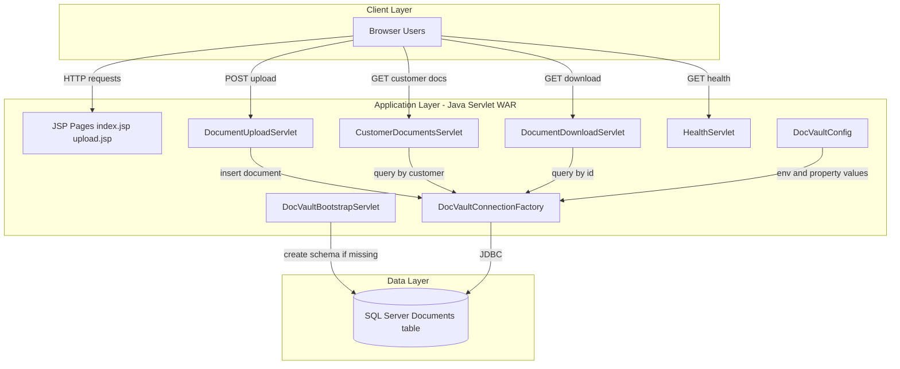
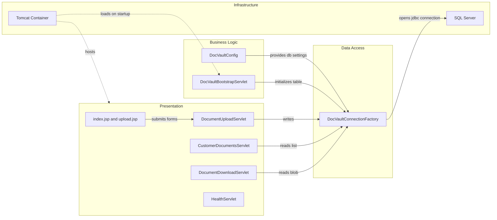

# Architecture Diagram

This document summarizes the current architecture of ZavaDocVault and its major runtime components.

## Application Architecture

### Technology Stack Summary

| Layer | Technology | Version | Purpose |
|---|---|---|---|
| Presentation | JSP + Servlet endpoints | Servlet 3.1 | Browser UI and HTTP entry points |
| Business Logic | Plain Java servlet handlers | Java 8 | Document upload, listing, and download logic |
| Data Access | JDBC via SQL Server driver | mssql-jdbc 12.6.3.jre8 | Direct SQL queries and persistence |
| Runtime | Apache Tomcat | 9 (Docker base image) | Hosts ROOT.war |

### Data Storage & External Services

The application uses a single Microsoft SQL Server database table (`Documents`) for binary document storage and metadata. No additional cache, queue, or third-party API integrations were detected.

### Key Architectural Decisions

- Uses classic Java EE servlet mappings in `web.xml` instead of Spring Boot or JAX-RS.
- Uses direct JDBC access with SQL statements embedded in servlet classes.
- Bootstraps schema at startup through a load-on-startup servlet.

## Component Relationships

### Component Inventory

| Component | Layer | Type | Responsibility |
|---|---|---|---|
| DocumentUploadServlet | Presentation | Servlet | Accepts multipart upload and stores document rows |
| CustomerDocumentsServlet | Presentation | Servlet | Returns customer document metadata as JSON |
| DocumentDownloadServlet | Presentation | Servlet | Streams document bytes to client |
| HealthServlet | Presentation | Servlet | Returns application health page |
| DocVaultBootstrapServlet | Business Logic | Startup Servlet | Ensures `Documents` table exists on startup |
| DocVaultConfig | Business Logic | Config Utility | Resolves DB settings from env/properties |
| DocVaultConnectionFactory | Data Access | JDBC Factory | Opens SQL Server JDBC connections |
