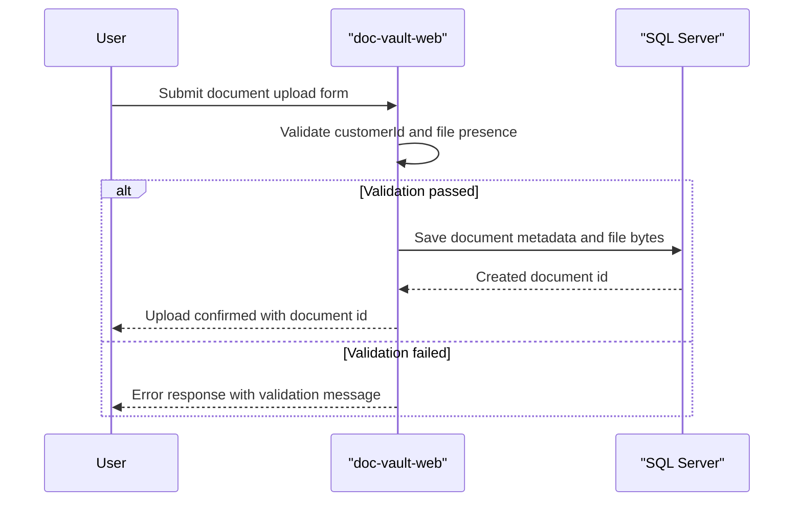

# Core Business Workflows

ZavaDocVault supports customer document intake and retrieval so users can upload files and later view or download them by customer and document identifiers.

## Domain Entities

| Entity | Service / Bounded Context | Description | Key Relationships |
|---|---|---|---|
| Document | Document Vault | Stored customer file with type and upload timestamp | Belongs to a customer via `CustomerID` |
| Customer | Document Vault | External business identity referenced for document ownership | One customer can have many documents |

## Service-to-Domain Mapping

| Service | Domain Context | Owned Entities | External Dependencies |
|---|---|---|---|
| doc-vault-web | Document Vault | Document | SQL Server |

## Primary Workflows

### Workflow 1: Upload Customer Document

1. User opens upload page and submits `customerId`, optional `documentType`, and a file.
2. Service validates customer id and non-empty file presence.
3. Service inserts the document record and binary content into SQL Server.
4. Service returns JSON containing upload status and generated document id.

### Workflow 2: Retrieve Customer Documents

1. User requests documents for a customer id.
2. Service validates numeric customer id format.
3. Service queries SQL Server for matching records sorted by uploaded date.
4. Service returns a JSON list of document metadata.

### Workflow 3: Download Document

1. User requests a document by id.
2. Service validates numeric id format.
3. Service queries SQL Server for file metadata and payload.
4. Service streams file bytes back to the client.

## Cross-Service Data Flows

No cross-service composition flow was found. All workflow data is handled in one service and one SQL Server store, so fallback behavior is limited to returning HTTP error responses when database operations fail.

## Business Workflow Sequence

## Business Rules & Decision Logic

- `customerId` and document id must be numeric for list/download operations.
- Upload requires a non-empty multipart file part.
- `documentType` defaults to `General` when omitted.
- On database failures, workflows terminate with server-error responses and no compensating transaction flow.
