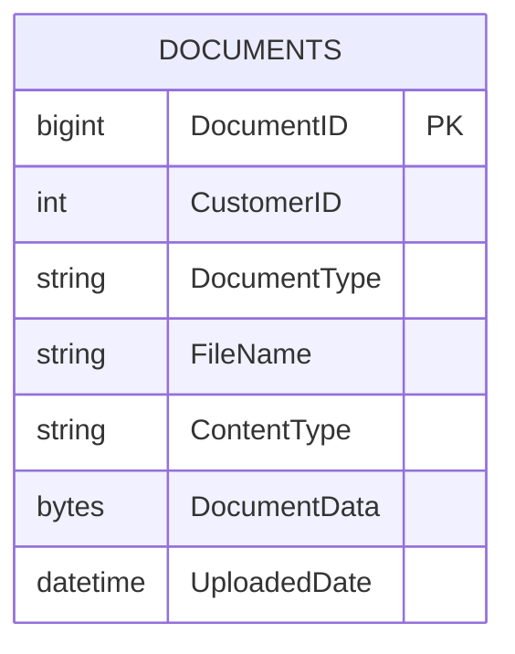

# Data Architecture & Persistence Layer

The persistence layer is centered on one SQL Server table accessed through direct JDBC from servlet classes, with no ORM framework.

## Database Configuration

| Service/Module | DB Type | Profile | Driver | Connection | Migration Tool |
|---|---|---|---|---|---|
| doc-vault-web | Microsoft SQL Server | default | com.microsoft.sqlserver:mssql-jdbc:12.6.3.jre8 | JDBC URL assembled from env vars and `doc-vault.properties` | Startup bootstrap servlet creates table if missing |

## Data Ownership per Service

| Service | Tables Owned | ORM Framework | Caching | Notes |
|---|---|---|---|---|
| doc-vault-web | Documents | JDBC (no ORM) | None | Owns document metadata and binary payloads |

## Entity Model

## Key Repository Methods

| Service | Repository | Notable Methods | Purpose |
|---|---|---|---|
| doc-vault-web | Embedded SQL in servlets (`DocumentUploadServlet`, `CustomerDocumentsServlet`, `DocumentDownloadServlet`) | `INSERT INTO Documents ...`, `SELECT ... WHERE CustomerID = ?`, `SELECT ... WHERE DocumentID = ?` | Create documents, list customer documents, fetch binary content by id |

## Caching Strategy

No application-level caching provider, cache region, or cache annotation usage was identified.

## Data Ownership Boundaries

The application uses a single data store and a single service boundary, so no cross-service data ownership split is present. All read and write operations for document data are handled directly by the web service against the same `Documents` table.

### Data Classification & Sensitivity

| Entity | Sensitive Fields | Classification (PII/PHI/PCI/None) | Controls in Place |
|---|---|---|---|
| DOCUMENTS | `CustomerID`, `FileName`, `DocumentData` | PII | No explicit encryption-at-rest, masking, or field-level access control found in source |
