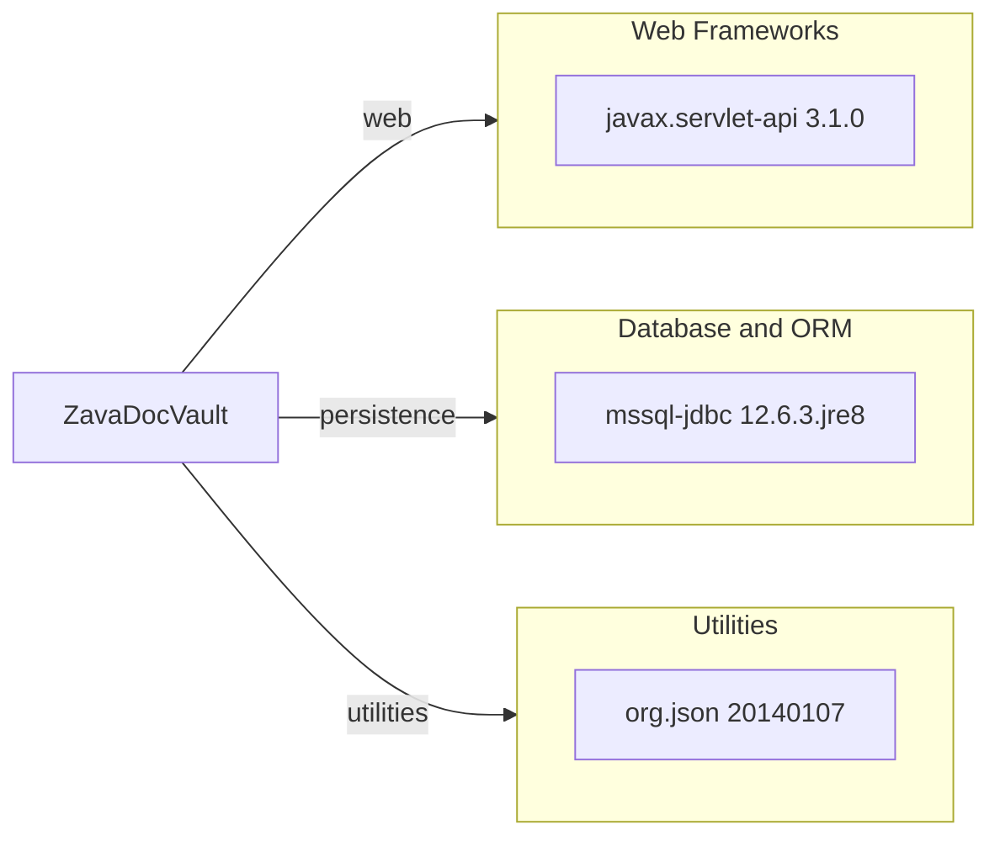

# Dependency Map

This document summarizes declared dependencies for ZavaDocVault (3 non-test dependencies).

## Dependencies

### Dependency Summary

| Category | Count | Key Libraries | Notes |
|---|---:|---|---|
| Web Frameworks | 1 | javax.servlet-api 3.1.0 | Provided by servlet container at runtime |
| Database and ORM | 1 | mssql-jdbc 12.6.3.jre8 | SQL Server connectivity |
| Utilities | 1 | org.json 20140107 | JSON object and array serialization |

### Version & Compatibility Risks

`org.json:json:20140107` is significantly old and may lack modern fixes and APIs. The app targets Java 8 and Servlet 3.1, which can limit compatibility with newer cloud-native Java stacks.

### Notable Observations

- Dependency footprint is intentionally minimal with only three declared libraries.
- No dedicated logging framework dependency is declared.
- No resilience, security, or observability libraries are declared in the build file.

## Test Dependencies

| Framework | Version | Notes |
|---|---|---|
| None detected | n/a | No test-scoped dependencies declared in `build.gradle` |

Total test-scope dependencies: 0
No test dependencies detected.
